<!-- ===================== HEADER ===================== -->

<!-- ===================== ABOUT ===================== -->
## About Me

-  **M.Sc. Computer Science** from **York University** (Toronto, ON)
-  Research Assistant at **[PACS Lab](https://github.com/pacslab)**, building AI platforms and ML systems for the cloud
-  I work at the intersection of **AI infrastructure, cloud platforms, and agentic AI**

##  Recent Projects

-  **[CAIOS](https://github.com/AlirezaAbedinii/CAIOS)**: Canadian AI Operating System, a private AI platform for researchers on a multi-node GPU cluster
-  **[Groundwork](https://github.com/AlirezaAbedinii/groundwork-agents)**: a grounded multi-agent research assistant built on LangGraph, MCP, and hybrid RAG

##  Research

- **PAMBA**: *Partition-Aware and Multi-SLO Batching for Serverless Inference* ([MPHB-serverless-inference](https://github.com/AlirezaAbedinii/MPHB-serverless-inference))

##  Tech Stack

  <b>Languages</b> 
  

  <b>AI & ML</b> 
  

  <b>MLOps · Cloud · Observability</b> 
  

  <b>Backend · Data · Tools</b> 
  

##  Contributions

<picture>
  <source media="(prefers-color-scheme: dark)" srcset="https://raw.githubusercontent.com/AlirezaAbedinii/AlirezaAbedinii/output/github-snake-dark.gif" />
  <source media="(prefers-color-scheme: light)" srcset="https://raw.githubusercontent.com/AlirezaAbedinii/AlirezaAbedinii/output/github-snake.gif" />
  
</picture>

<!-- ===================== CONNECT ===================== -->
## 🤝 Connect With Me

  
  

  ⭐️ Thanks for visiting — Alireza Abedini · Toronto, ON 🇨🇦

